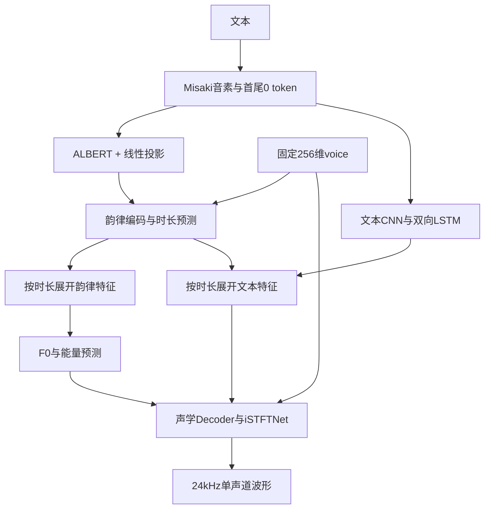

# 7.48M Kokoro 蒸馏：模型组装、训练、数据与评估

记录日期：2026-09-23。对应已完成的 `runs/majestic_student7m_boundary_20260922`，共20,000步。本文描述修正首尾监督后从随机初始化重训的版本；旧的有问题运行已删除，不能混用其指标。

## 1. 实验对象与结论边界

| 对象 | 含义 | 本文用途 |
|---|---|---|
| 官方原始82M | `hexgrad/Kokoro-82M` 通用v1.0，未经本项目微调 | 结构与初始化来源；没有本协议下的450条实测，不填造分数 |
| 82M微调基线 | 完整重跑，Stage 1四轮、Stage 2十轮 | 同协议质量参照 |
| 82M教师 | Stage 2延长到20轮、后期提高长样本权重 | 蒸馏目标及主要对比对象 |
| 7.48M final | 修正后随机初始化训练的第20,000步 | 最终模型 |
| 7.48M best-ASR | 同一运行第12,000步 | 按周期评估选择的ASR最佳候选，不等于主观音质最佳 |

学生有7,477,702个推理参数，约为82M的9.1%。固定文本上可懂度接近教师，但音色相似度仍有损失；不能用参数缩小约11倍推导速度提高11倍。CPU实时率、独立长文本集和主观听感尚未完成正式对照。

## 2. 新模型怎样组装

入口：[Student](../distillation/model.py)，配置：[student_7m.json](../configs/student_7m.json)。沿用Kokoro的五个模块，缩小宽度，整体合成路线不变。



| 配置 | 原始82M | 学生7.48M |
|---|---:|---:|
| ALBERT隐藏维度 | 768 | 192 |
| 注意力头数 | 12 | 3 |
| ALBERT中间层 | 2048 | 768 |
| ALBERT计算层数 | 12，跨层共享参数 | 12，跨层共享参数 |
| 线性投影 | 768→512 | 192→160 |
| 文本/韵律主体隐藏维度 | 512 | 160 |
| 文本CNN层数、卷积核 | 3层、5 | 相同 |
| Decoder隐藏/输出通道 | 1024 / 512 | 256 / 128 |
| 声码器上采样初始通道 | 512 | 128 |
| 声码器残差卷积核 | 3、7、11 | 3、7 |
| 上采样倍率 | 10×6 | 相同 |
| iSTFT FFT / hop | 20 / 5 | 相同 |
| 音色条件 | 128声学 + 128韵律 | 相同 |
| token槽位 / 最大序列长度 | 178 / 512 | 相同 |

ALBERT参数共享指同一套Transformer层权重重复用于12层计算，隐藏状态逐层变化。权重只存一份，但仍需执行12层计算。其他四个模块并不与ALBERT共享权重。

五组权重名称为 `bert`、`bert_encoder`、`predictor`、`text_encoder`、`decoder`。文本编码器是embedding、三层CNN和双向LSTM；韵律分支输出时长，并在展开后预测F0和能量。Decoder接收文本特征、F0、能量和声学音色条件，最终输出波形。

学生随机初始化，不截取82M权重，也不加载发布的英文7M权重。参考结构来自固定版本 `oddadmix/Kokoro-7M-Distill@9357717e6499717b769ab65de61797aa7c501c86`；发布权重仅用于结构与严格加载预检。来源和许可证保留在[供应代码记录](../vendor/sources.json)及 `vendor/kokoro7m/`。

固定voice来自本项目82M教师的 `majestic.pt`，不是官方英文音色。前128维控制声学音色，后128维控制韵律。本轮不训练voice。时长头bias依据训练缓存平均每token约2.029帧初始化，避免50个sigmoid初值求和造成过长输出。

## 3. 数据到底有哪些

### 3.1 原始音色数据与教师

原始约100小时MajesticVoice由VoxCPM2合成，中文50h、英文25h、混读25h，经ASR、音色相似度、DNSMOS、削波和静音筛选。文本来自HiFiTTS、WenetSpeech4TTS Premium、Emilia2及当时明确批准的既有人工复核DOTA脚本。原始数据是合成语音，不是真人录音训练集。

82M先在这些数据上完成音色适配，蒸馏教师采用20轮长样本加权实验的最终导出：

`runs/majestic_s2_20ep_long_resume6k_20260921/eval/stage2_final`

### 3.2 本轮学生实际读取的数据

学生不直接重建原始VoxCPM2音频。对既有文本划分，由82M教师以同一固定voice、speed=1整句生成音频，并同时保存生成该波形时使用的时长、F0和能量。

| 缓存划分 | 条数 | 教师音频小时 | 中文 / 英文 / 混读条数 |
|---|---:|---:|---|
| train | 53,723 | 100.6463 | 25,323 / 16,515 / 11,885 |
| val | 400 | 0.7671 | 192 / 115 / 93 |

训练最长20.225秒，验证最长18.775秒，缓存审计没有发现削波记录。608条原有保留测试数据不用于训练，也没有作为本轮独立最终验收报告。450条固定周期评估另见第6节。

缓存目录为 `data/distill7m_teacher_long20`，生成脚本为[dump_teacher.py](../distillation/dump_teacher.py)。每条NPZ保存PCM16音频、含首尾0的ids、整数dur、F0、energy、来源索引和协议哈希。必须满足：

```text
len(ids) = len(dur)
音频采样数 = sum(dur) × 600
F0帧数 = energy帧数 = sum(dur) × 2
```

24kHz下一个时长帧为25ms；F0/能量为其两倍帧率。教师预测时长与教师生成波形配套，不能把这套时长直接贴到原始VoxCPM2录音上。缓存来源、模型和voice哈希见[缓存审计](evaluation/distillation_7m/teacher_cache_audit.json)。

### 3.3 后续新增50小时长文本

目标为中文25h、英文12.5h、混读12.5h，每条至少三个完整句子、实际音频15–45秒，有效Kokoro音素不超过510，与已有100h去重。沿用VoxCPM2及原质检路径，数据保存在 `data/majestic_long50h`。

**这批新增数据是在当前学生训练完成后才开始合成，没有用于本文任何学生checkpoint，也没有贡献下面的评估成绩。** 后续若用于训练，需新建数据版本及实验记录。详见[合成脚本说明](../data_generation/majestic_long/README.md)。

## 4. 蒸馏怎样训练

训练入口为[train.py](../distillation/train.py)。每批按以下顺序运行：

1. 对完整文本编码。mask按真实长度建立，首尾0是有效token，批量padding才被屏蔽。
2. 学生预测连续时长，用教师整数时长监督；训练展开使用教师时长，以便波形目标对齐。
3. 展开的韵律特征预测F0与能量，直接对齐教师缓存的对应轨迹。
4. 对文本特征、F0、能量和教师波形取同一时间窗口，输入学生Decoder。
5. 对完整窗口计算重建、静音、感知及对抗损失，更新学生和判别器。

推理时不需要教师：学生预测时长经过round并至少取1帧，再展开文本与韵律特征，预测F0/能量并生成波形。

### 4.1 首尾监督修正

旧实现每个窗口两端各剔除约0.5秒再评分，真实句首句尾也被剔除，因此缺少直接声学监督。修正后 `crop_frames=120`、`context_frames=0`，约3秒窗口完整参与损失，短样本按批内最短帧数缩短。

窗口起点均匀随机取自所有合法位置，包含最后一个合法起点；不额外提高句首句尾抽样比例。确定性验证取中间窗口。这里与82M微调对齐的是“整个窗口参与声学损失”，不是把全部训练目标改为与微调完全相同。学生时长L1仍包含首尾。

旧学生、优化器和训练步数均未恢复，本轮从零重训。旧运行已按要求删除，保留[清理记录](../reports/distill7m_old_run_cleanup.json)。修复设计缺口不等于已经证明所有边界噪声消失。

### 4.2 参数与损失

| 项目 | 实际配置 |
|---|---|
| 训练规模 | 四卡DDP，每卡16，全局64；20,000步 |
| 优化器 | AdamW，betas=(0.8,0.99)，weight decay=0.01 |
| 学生 / 判别器基础LR | 均为2e-4 |
| 调度 | 500步线性warmup，乘以cosine系数，最终约2e-5 |
| 梯度裁剪 | 学生、判别器分别5 |
| 数值精度 | 文本/循环/韵律分支FP32，Decoder、GAN、WavLM采用BF16 autocast |
| 评估保存 | 每1000步；第100步小规模冒烟；结束完整保存与评估 |

生成器目标：

```text
5×STFT + 5×log-Mel L1 + 5×duration L1 + 100×silence
+ WavLM + F0 + energy + GAN_adversarial + GAN_features + GAN_relative
```

- STFT：三组FFT 1024/2048/512，谱收敛与log幅度L1后取平均。
- Mel：80个频带，FFT1024、hop256，log-Mel L1。
- 静音：10ms窗口，教师RMS低于1e-3时，只惩罚学生超过教师的RMS。
- F0：smooth-L1再除以10；能量：L1；均用有效帧mask。
- WavLM：冻结的感知特征匹配，不是推理模块。
- GAN：多周期与多分辨率谱判别器，含对抗、特征匹配和相对损失。前500步更新判别器但不把生成器GAN项加进总损失，之后启用。

7.48M仅统计推理学生，不含训练判别器、冻结WavLM和固定voice。训练显存不能按7.48M推理权重体积估算。

## 5. 保存、导出与使用

checkpoint保存学生、判别器、两个优化器、配置、架构、数据哈希、逐rank随机状态/buffer、采样位置和voice。支持同配置/数据/world-size恢复；CUDA反向不保证逐位确定，预检说明见[恢复检查](../reports/distill7m_resume_check.json)。

导出文件包括 `kokoro.pth`（五组嵌套权重）、`config.json`（学生结构）、`majestic.pt`（固定voice，兼容形状510×1×256）及 `export.json`。不能用默认82M构造器直接加载缩窄权重。

在项目根目录，使用已有导出合成的最小示例：

```python
import json
from pathlib import Path
import torch
import soundfile as sf
from distillation.model import Student
from training.frontend import Frontend

p = Path('runs/majestic_student7m_boundary_20260922/eval/final')
model = Student(json.loads((p / 'config.json').read_text())).cuda().eval()
model.load_nested(p / 'kokoro.pth')  # 每组严格加载
voice = torch.load(p / 'majestic.pt', map_location='cuda', weights_only=True)[0]
_, ids = Frontend()('今天我们一起检查模型的合成效果。', 'zh')
with torch.inference_mode():
    audio, durations = model.synthesize(ids, voice)
sf.write('student.wav', audio.cpu().numpy(), 24000, subtype='PCM_16')
```

有效音素最多510，加首尾0后最多512；代码还限制预测输出不超过120秒。这是保护上限，不是已经验证120秒长句效果。部署长文应在完整句子边界分段，不能静默丢掉超长token。

## 6. 评估协议与选模

固定450条：中文200、英文200、混读50；所有下表模型均450条完成、0条评估失败。使用相同文本、Kokoro前端与参考音频，由Qwen3-ASR、WavLM/CAMPPlus和DNSMOS评分。英文相似度参考是批准的reference-4；中文与混读使用中文参考。

原继承的 `eval_protocol.json` 仍记载650条（含LJSpeech 200），实际本项目清单已过滤为450条，不能把650写成此次评估样本量。评分适配器仍依赖本机LITs评价代码和独立ASR/metrics环境，迁移合成脚本没有消除这一评价依赖。

ASR列采用micro：中文CER、英文WER、混读CER，数值乘100显示百分比；越低越好。音色相似度和DNSMOS列为逐样本均值，越高越好。混读CER不能替代混读英语词错误率。

选模分数为 `(中文CER_micro + 英文WER_micro + 混读CER_micro) / 3`，三语言等权；并列再取三语言平均CAMP较高者。第100步冒烟不参与选择。此固定集被周期性用于选模，不能当成从未看过的独立最终测试集。

## 7. 最终评估对比

### 中文（200条）

| 模型 | ASR错误率 % ↓ | WavLM ↑ | CAMP ↑ | DNSMOS OVRL ↑ | SIG ↑ | BAK ↑ |
|---|---:|---:|---:|---:|---:|---:|
| 82M微调基线 | 0.3175 | 0.8340 | 0.7470 | 3.4754 | 3.6889 | 4.1951 |
| 82M教师 | 0.2116 | 0.8380 | 0.7689 | 3.4758 | 3.6874 | 4.1973 |
| 7.48M final / 20k | 0.2910 | 0.8073 | 0.7439 | 3.4662 | 3.6778 | 4.2014 |
| 7.48M best-ASR / 12k | 0.1587 | 0.8000 | 0.7404 | 3.4304 | 3.6536 | 4.1727 |

### 英文（200条）

| 模型 | ASR错误率 % ↓ | WavLM ↑ | CAMP ↑ | DNSMOS OVRL ↑ | SIG ↑ | BAK ↑ |
|---|---:|---:|---:|---:|---:|---:|
| 82M微调基线 | 0.8691 | 0.8155 | 0.8205 | 3.3764 | 3.5996 | 4.1896 |
| 82M教师 | 0.8209 | 0.8139 | 0.8201 | 3.3691 | 3.5913 | 4.1886 |
| 7.48M final / 20k | 0.8209 | 0.7940 | 0.8127 | 3.3050 | 3.5275 | 4.1823 |
| 7.48M best-ASR / 12k | 0.7726 | 0.7730 | 0.8084 | 3.2853 | 3.5153 | 4.1633 |

### 混读（50条）

| 模型 | ASR错误率 % ↓ | WavLM ↑ | CAMP ↑ | DNSMOS OVRL ↑ | SIG ↑ | BAK ↑ |
|---|---:|---:|---:|---:|---:|---:|
| 82M微调基线 | 0.0887 | 0.7759 | 0.7206 | 3.4457 | 3.6745 | 4.1890 |
| 82M教师 | 0.0887 | 0.7872 | 0.7339 | 3.4557 | 3.6827 | 4.1897 |
| 7.48M final / 20k | 0.0887 | 0.7510 | 0.7071 | 3.4341 | 3.6602 | 4.1930 |
| 7.48M best-ASR / 12k | 0.0887 | 0.7422 | 0.7040 | 3.4114 | 3.6439 | 4.1749 |

### 如何理解结果

- final学生中文CER为0.2910%，教师为0.2116%，增加0.0794个百分点；英文WER和混读CER与教师相同。不能表述为学生在所有语言上都更好。
- final学生三语言WavLM/CAMP均低于教师，说明音色保真仍有差距；DNSMOS也略低，英文差距相对更明显。
- 12k学生的选模分数更低，但20k学生三语言音色相似度及DNSMOS均比12k更高。ASR最优与音质/音色最优不是同一选择。
- 四个模型的混读英语WER_micro均为4.1667%；混读CER很低并不代表英语词完全无错，且只有50条混读样本。
- 这些是自动评估结果，不是人工MOS，也不能确认首尾噪声、长句稳定性或语速问题已经解决。后续VoxCPM2首句上下文探针属于数据合成诊断，不是7M/82M模型A/B成绩。

原始汇总与哈希均保存在[evaluation/distillation_7m](evaluation/distillation_7m/sources.json)。学生最终结果：[summary](evaluation/distillation_7m/student_final_summary.json)；12k候选：[summary](evaluation/distillation_7m/student_best_summary.json)；82M教师：[summary](evaluation/stage2_long_weighted_final/summary.json)；82M基线：[summary](evaluation/stage2_baseline_rerun_final/summary.json)。

## 8. 复现与后续验收

正式配置和初始化证据分别见[config](evaluation/distillation_7m/config.json)、[initialization](evaluation/distillation_7m/initialization.json)，其中 `initial_weights=null`、`loaded_parameters=0`、`resumed=null`。运行源码快照在本机运行目录的 `source/`，仓库最新源码可能包含后续运维更新。

训练/恢复入口（已有进程时不要重复启动）：

```bash
.venv/bin/python -m distillation.run \
  --run-dir "$PWD/runs/majestic_student7m_boundary_20260922" \
  --cache "$PWD/data/distill7m_teacher_long20" \
  --config "$PWD/configs/distill_7m.json"
```

这个目录已完成训练，以上命令不会创建新的从零实验；新实验应使用新目录。TensorBoard统一32003，学生曲线名 `student7m_boundary_train` / `student7m_boundary_eval`。checkpoint、音频和教师缓存不入Git，文档中的本机路径并不代表克隆仓库后已带这些文件。

下一轮验收应单独覆盖：保留测试集、至少三句/15秒长文本、首尾噪声、漏读重复、同句短/长上下文的时长变化、CPU/GPU实时率和部署内存。新增50小时完成质检后另行冻结清单，才能用于新的训练与对照实验。
